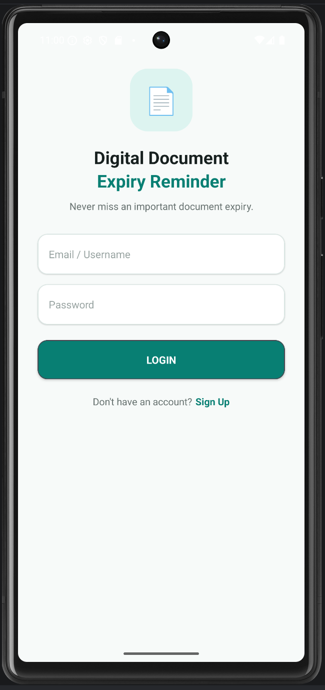
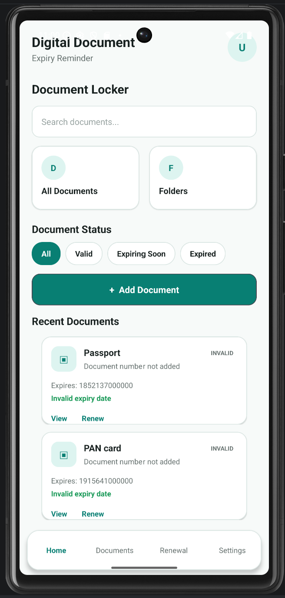
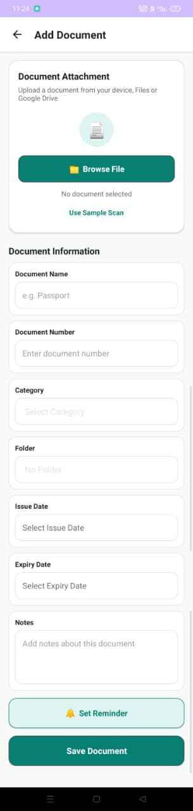
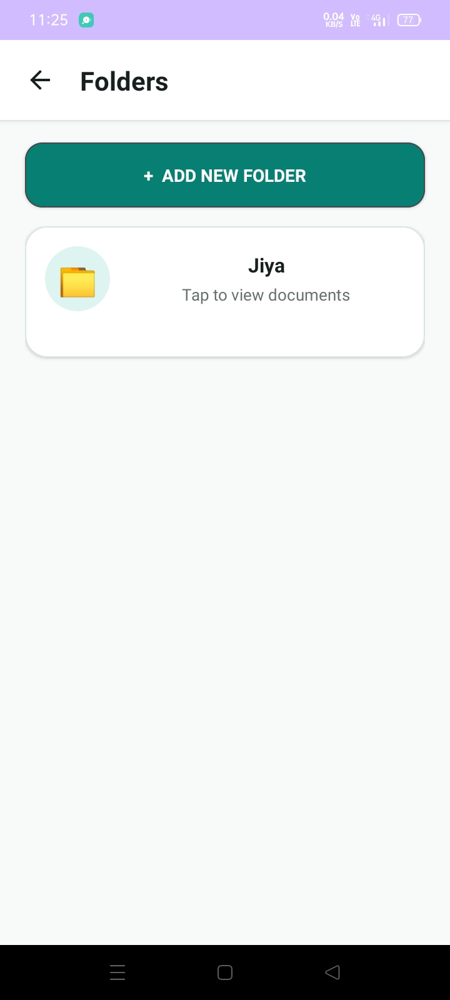
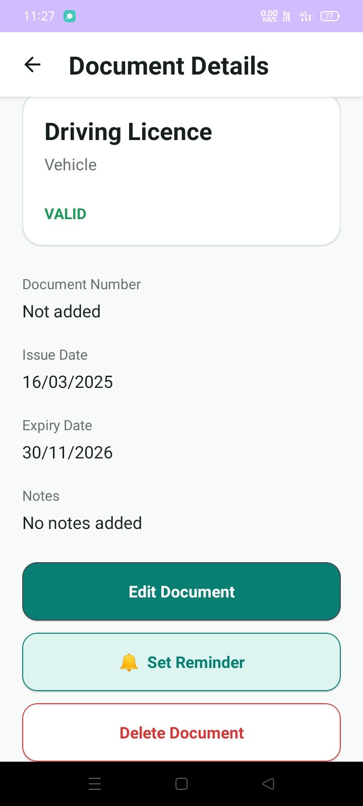
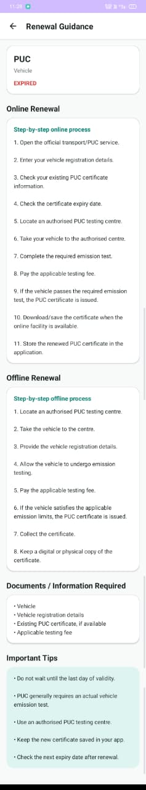
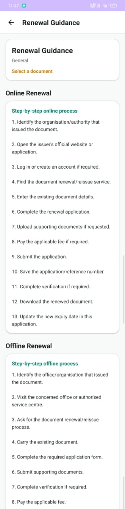
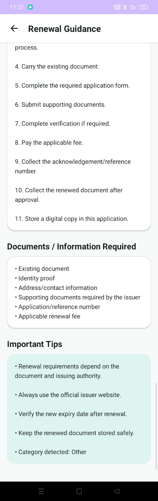
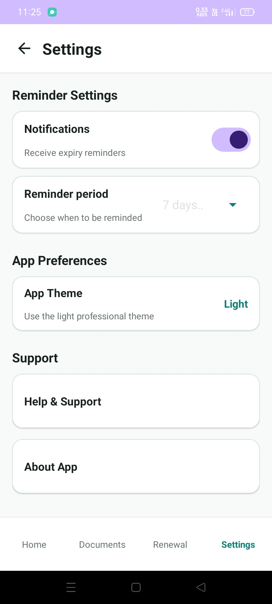
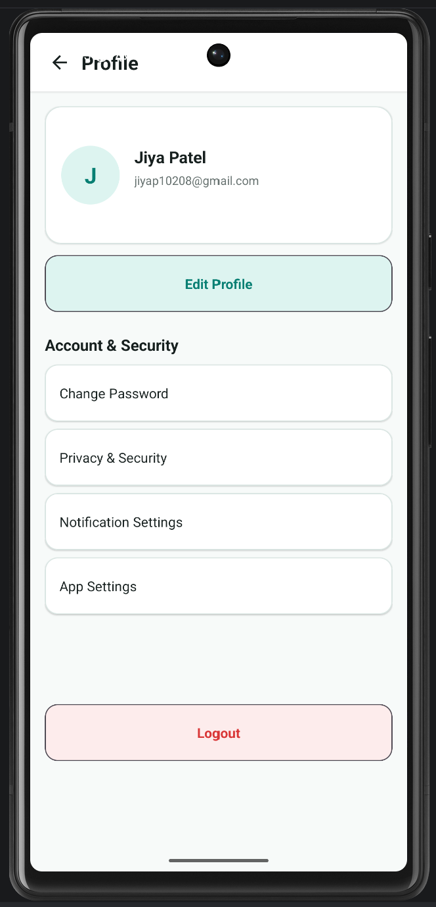

# 📄 Digital Document Expiry Reminder

> An Android application for storing, managing, organizing, and tracking important documents and their expiry dates.

## 📱 About the Project

**Digital Document Expiry Reminder** is an Android mobile application developed using **Kotlin and Android Studio**.

The application helps users manage important documents such as identity cards, passports, driving licences, insurance documents, certificates, and other documents that have expiry dates.

Users can add documents, store their details, view expiry information, edit or delete documents, organize documents into folders, and check reminders from one place.

---

## ✨ Features

### 🔐 Login

* User login interface
* Username / Email input
* Password input
* Simple and clean UI
* Navigation to the main application

### 🏠 Home Dashboard

The Home Dashboard provides quick access to the main features of the application.

* Total document count
* Add Document
* My Documents
* Reminders
* Folders
* Settings
* Profile

### ➕ Add Document

Users can add important information about their documents:

* Document Name
* Document Type
* Document Number
* Issue Date
* Expiry Date
* Folder
* Notes

### 📋 My Documents

Users can view and manage all saved documents.

* View documents
* Search documents
* View document details
* Edit documents
* Delete documents
* Check expiry status

### 📄 Document Details

Users can open an individual document and view its complete information.

* Document name
* Document type
* Document number
* Issue date
* Expiry date
* Notes
* Edit option
* Delete option

### ⏰ Expiry Tracking

Documents can be identified based on their expiry dates.

| Status      | Description                    |
| ----------- | ------------------------------ |
| 🟢 Valid    | Document is currently valid    |
| 🟠 Due Soon | Document expiry is approaching |
| 🔴 Expired  | Document has already expired   |

### 🔔 Reminders

The Reminders section helps users identify documents whose expiry dates are approaching.

### 🗂️ Folders

Documents can be organized into folders.

Users can:

* Create folders
* View folders
* Edit folders
* Delete folders
* Organize documents

### ⚙️ Settings

The Settings section provides application preference options.

### 👤 Profile

Users can access their profile from the application.

---

# 📸 Application Screenshots

All application screenshots are available in the [`screenshot`](https://github.com/jiyapatel02/Expiry_Reminder_Project/tree/master/screenshot) folder.

## 🔐 Login & 🏠 Home

<p align="center">
  
  &nbsp;&nbsp;&nbsp;
  
</p>

## ➕ Add Document & 📋 My Documents

<p align="center">
  
  &nbsp;&nbsp;&nbsp;
  
</p>

## 📄 Document Details & ✏️ Edit Document

<p align="center">
  
  &nbsp;&nbsp;&nbsp;
  
</p>

## 🔔 Reminders & 🗂️ Folders

<p align="center">
  
  &nbsp;&nbsp;&nbsp;
  
</p>

## ⚙️ Settings & 👤 Profile

<p align="center">
  
  &nbsp;&nbsp;&nbsp;
  
</p>

---

# 🔄 Application Flow

```text
                         ┌─────────────────┐
                         │  Login Screen   │
                         └────────┬────────┘
                                  │
                                  ▼
                         ┌─────────────────┐
                         │ Home Dashboard  │
                         └────────┬────────┘
                                  │
             ┌────────────────────┼────────────────────┐
             │                    │                    │
             ▼                    ▼                    ▼
      ┌─────────────┐      ┌─────────────┐      ┌─────────────┐
      │Add Document │      │My Documents │      │  Reminders  │
      └──────┬──────┘      └──────┬──────┘      └─────────────┘
             │                    │
             ▼                    ▼
      ┌─────────────┐      ┌─────────────┐
      │ Save Data   │      │   Details   │
      └─────────────┘      └──────┬──────┘
                                  │
                           ┌──────┴──────┐
                           │             │
                           ▼             ▼
                         Edit          Delete

             ┌────────────────────┬────────────────────┐
             │                    │                    │
             ▼                    ▼                    ▼
        ┌─────────┐          ┌─────────┐          ┌─────────┐
        │ Folders │          │Settings │          │ Profile │
        └─────────┘          └─────────┘          └─────────┘
```

---

# 🛠️ Technologies Used

| Technology            | Purpose                                 |
| --------------------- | --------------------------------------- |
| **Kotlin**            | Android application development         |
| **Android Studio**    | Development environment                 |
| **XML**               | User interface design                   |
| **ConstraintLayout**  | Application layouts                     |
| **MaterialCardView**  | Card-based UI components                |
| **RecyclerView**      | Displaying document lists               |
| **SharedPreferences** | Local data storage                      |
| **JSON**              | Data representation and storage         |
| **Android SDK**       | Android platform development            |
| **Gradle**            | Project build and dependency management |

---

# 💾 Data Storage

The application uses **SharedPreferences** for local storage.

Document information is represented using **JSON**, allowing multiple document records to be stored and retrieved from the device.

```text
              ┌──────────────────────┐
              │   User enters data   │
              └──────────┬───────────┘
                         │
                         ▼
              ┌──────────────────────┐
              │     Document Data    │
              └──────────┬───────────┘
                         │
                         ▼
              ┌──────────────────────┐
              │      JSON Array      │
              └──────────┬───────────┘
                         │
                         ▼
              ┌──────────────────────┐
              │  SharedPreferences   │
              └──────────┬───────────┘
                         │
                         ▼
              ┌──────────────────────┐
              │    Application UI    │
              └──────────────────────┘
```

The application stores data locally, so an external database or server is not required for the basic document-management functionality.

---

# 🎨 UI Design

The application follows a clean and professional **teal-based user interface**.

### Color Palette

| UI Element     | Color     |
| -------------- | --------- |
| Primary Teal   | `#087F73` |
| Primary Dark   | `#05665C` |
| Primary Light  | `#DDF4F0` |
| Background     | `#F7FAF9` |
| Cards          | `#FFFFFF` |
| Primary Text   | `#17201F` |
| Secondary Text | `#66716F` |
| Hint Text      | `#9AA5A3` |

The application uses **ConstraintLayout** for layouts and **MaterialCardView** for modern card components.

---

# 📂 Project Structure

```text
Expiry_Reminder_Project/
│
├── .idea/
│
├── app/
│   └── src/
│       └── main/
│           ├── java/
│           ├── res/
│           └── AndroidManifest.xml
│
├── gradle/
│
├── screenshot/
│   ├── 1.png
│   ├── 2.png
│   ├── 3.jpeg
│   ├── 4.jpeg
│   ├── 5.jpeg
│   ├── 6.jpeg
│   ├── 7.jpeg
│   ├── 8.jpeg
│   ├── 9.jpeg
│   └── 10.png
│
├── .gitignore
├── README.md
├── build.gradle.kts
├── gradle.properties
├── gradlew
├── gradlew.bat
└── settings.gradle.kts
```

---

# 🧪 Application Testing

The following major functions can be tested:

| Test Case                  | Expected Result                    |
| -------------------------- | ---------------------------------- |
| Launch application         | Application opens successfully     |
| Open Login                 | Login screen is displayed          |
| Enter login details        | User proceeds to the application   |
| Open Add Document          | Document form is displayed         |
| Enter document information | Information is accepted            |
| Save document              | Document is stored locally         |
| Open My Documents          | Saved document is displayed        |
| Add multiple documents     | Documents are displayed correctly  |
| Search document            | Matching document is displayed     |
| Open document              | Document details are displayed     |
| Edit document              | Updated information is saved       |
| Delete document            | Document is removed                |
| Check expiry date          | Correct expiry status is displayed |
| Open Reminders             | Reminder section is displayed      |
| Open Folders               | Folder section is displayed        |
| Edit folder                | Folder information is updated      |
| Delete folder              | Folder is removed                  |
| Open Settings              | Settings page is displayed         |
| Open Profile               | Profile page is displayed          |

---

# 🚀 How to Run the Project

## Prerequisites

Before running the project, make sure you have:

* Android Studio installed
* Android SDK configured
* Kotlin support
* Android Emulator or physical Android device
* Internet connection for the initial Gradle synchronization

## Clone the Repository

```bash
git clone https://github.com/jiyapatel02/Expiry_Reminder_Project.git
```

## Open the Project

1. Open **Android Studio**.
2. Select **Open**.
3. Select the cloned `Expiry_Reminder_Project` folder.
4. Allow Gradle synchronization to complete.
5. Connect an Android device or start an emulator.
6. Click **Run ▶**.

---

# 📌 Project Information

| Category                    | Details                          |
| --------------------------- | -------------------------------- |
| **Project Name**            | Digital Document Expiry Reminder |
| **Project Type**            | Android Mobile Application       |
| **Domain**                  | Mobile Application Development   |
| **Programming Language**    | Kotlin                           |
| **UI Technology**           | XML                              |
| **Layout**                  | ConstraintLayout                 |
| **Development Environment** | Android Studio                   |
| **Local Storage**           | SharedPreferences                |
| **Data Format**             | JSON                             |

---

# 🔮 Future Enhancements

The following features can be added in future versions:

* ☁️ Cloud backup and synchronization
* 📷 Document image upload
* 📄 PDF document storage
* 📸 Document scanning using camera
* 🔐 Biometric authentication
* 🔔 Advanced scheduled notifications
* 🔎 Advanced search and filtering
* 📊 Document expiry statistics
* ☁️ Cloud storage integration
* 🔄 Backup and restore
* 🔑 Secure user authentication

---

# 🎓 Academic Project

This project was developed as an **academic Mobile Application Development project** to demonstrate practical Android development concepts.

### Concepts Demonstrated

* Kotlin programming
* Android Activities
* XML UI design
* ConstraintLayout
* Material UI components
* RecyclerView
* SharedPreferences
* JSON data handling
* CRUD operations
* Date handling
* Document management
* Folder management
* Application navigation

---

# 👩‍💻 Developer

**Jiya Patel**

**B.Tech Information Technology**

### GitHub

[Jiya Patel GitHub](https://github.com/jiyapatel02?utm_source=chatgpt.com)

### Project Repository

[Expiry Reminder Project](https://github.com/jiyapatel02/Expiry_Reminder_Project)

---

# 📜 License

This project was developed as an academic/educational project for demonstrating Android application development and Mobile Application Development concepts.

---

## ⭐ Project Summary

**Digital Document Expiry Reminder** provides a simple and organized solution for managing important documents and monitoring their expiry dates.

The application combines a clean Android interface, local data storage, document management, folders, CRUD operations, and expiry tracking to make document management easier and more organized.
